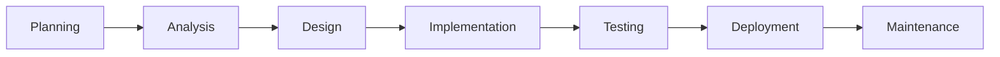
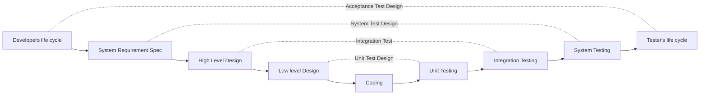
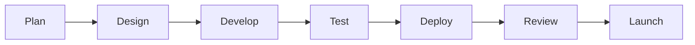

# Lecture 2

## Testing throughout SW lifecycle

- SDLC
- V Model
- Agile Methodology
- Agile Testing

---

### SDLC: Overview

- **Planning**: The project scope is defined and the project goals, requirements, timelines and resources are identified
- **Analysis**: gathering information about the software requirements from the stakeholders such as customers, end-users and business analysts.
- **Design**: includes the overall architecture of the software, data structures and intefaces
- **Implementation**: Coding according to the architecture already defined
- **Testing**: to ensure that it meets the requirements and works correctly
- **Deployment**: The software is deployed to a production environment and made available to end-users
- **Maintenance**: includes ongoing support, bug fixes, and updates to the software



---

### V-Model

#### Verification Phases (static analysis technique)

- Proper communication with the customer to understand their needs
- System Engineers work on product requirements
- List of modules, their funtionality, their interface, dependencies, database table,
    architecture diagrams, technology detail
- The detailed design of the modules is specified

#### Validation Phases (Dynamic analysis technique)

- Performed in a user environment
- Tests the complete application
- Testing the communication of modules among all assembled components
- Tests done by dev to determine any bugs related to code

#### Diagram



#### Principles

- From Large to Small
- Scalability
- Cross Referencing
- Traceability of Requirements

#### Pros and Cons

| Pros | Con |
| - | - |
| Simple and Easy | No good for complex and object-oriented projects |
| Improved Traceability | Inflexibility |
| Project Management are able to progress accurately | Time Consuming |
| Emphasis on Testing | High Risk Uncertainity |

### Agile Methodology

Agile is an iterative approach that breaks down a project into small, manageable parts called "sprints" or "iteration".
It's a flexiable way of SW development that allows for faster delivery of valuable features, better responsibilities to changing requirements, and a focus on delivering what the customer truly needs.



#### Agile Teams and Collaboration

- Scrum Team: A cross-functional, self organizinggroup of dedicated people (Group of Product Owner, Business Analyst, Developer's and QA's)
- PO: usually represents the Client. The one who prioritizes the list of Product Backlog.
- Scrum Master: acts as a facilitator to teh Scrum Development Team. Clarifies the queries and organizes the team from distractions and teaches team how to use scrum properly.


```mermaid
flowchart LR
                                        (Daily Scrum Meeting)
    Product Backlog --> Sprint Backlog --> Sprint --> Potentially Shipable Product
       / \       (Sprint Plnning Meeting)               |     (Sprint Review)
        |                                               |
        |                                               \/
        |--------------------------------- Retrospective Meeting
```

- Definition of Done(DoD): is a set of criteria that a product increment must meet for the team to consider
    it complete and ready for customers.
- Definition of Ready(DoR): a set of low-level and specific criteria. It defines when a backlog item is ready for a team to work on in an upcioming sprint.
- Acceptance Criteria: are defined as the conditions that must be satisfied for a product, user story or
    increment of work to be accepted
- User Story(US): 
